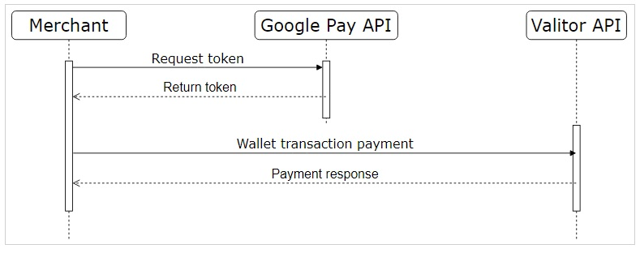
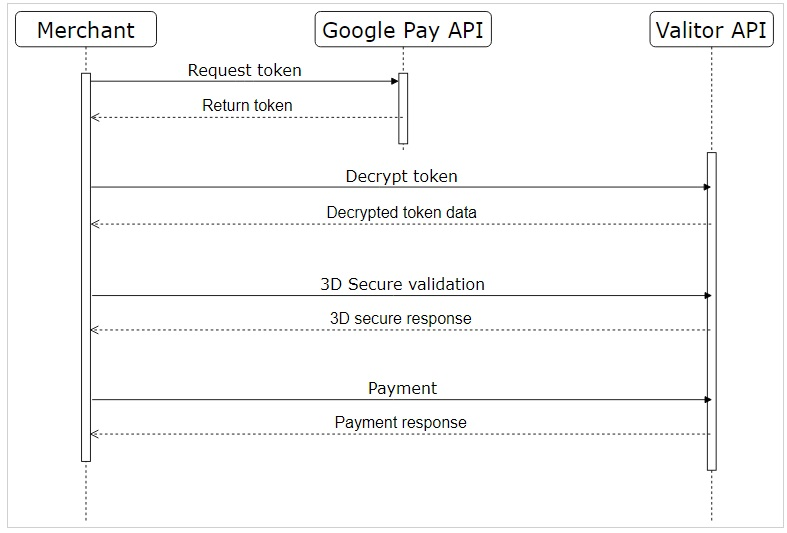

## Overview
Google Pay™ Integration is consisted of two flows:

### Tokenized
(Android™, Wallet transaction):



### Untokenized 
(Web Applications, Regular payment):



Contains additional steps for verifications. Additional calls should be performed (3DS and payment) in comparison with Tokenized flow


## Android™ application integration
### GooglePay Api

To integrate Google Pay™ acceptance into your application, follow instructions ([Google Pay Android developer documentation](https://developers.google.com/pay/api/android/overview),[Google Pay Android integration checklist](https://developers.google.com/pay/api/android/guides/test-and-deploy/integration-checklist) and [Google Pay Android brand guidelines](https://developers.google.com/pay/api/android/guides/brand-guidelines)). The sample app can be found in [Google Pay Android API documentation - sample app](https://developers.google.com/pay/api/processors/guides/test-and-validation/create-test-app).

Parameters:
- ProcessorName=valitor
- GatewayMerchantId=MerchantAgreementNumber

### Payment API:
URL: https://uat.valitorpay.com/Payment/CardPayment

**Request example:**
```
{     "operation": "Sale",
      "amount":11300,
      "currency":"ISK",
      "transactionType": "WalletTransaction",
      "Wallet": {
            "WalletType": "GooglePay",
             "GooglePay":{"signature":"MEUCIQDpFOEU3zscFVFym4QLpcXbzd8qqKwfAA38vp89HnvwjAIgIzSubChNVbJIN6yQYTQnOy7qwmAF2a59OPeiC8q4Tyw\u003d","intermediateSigningKey":{"signedKey":"{\"keyValue\":\"MFkwEwYHKoZIzj0CAQYIKoZIzj0DAQcDQgAEwVtSWMaS7R/1jL/8GqaZaP00lFLXCRKDTw9fZhxkDP4qEY/wqgid71ya246kAegJN41FgSsUpmkt8KbxB8ahJg\\u003d\\u003d\",\"keyExpiration\":\"1657834014469\"}","signatures":["MEQCIBPvajoD4UM183SRCRS7i0Jcb8IzdRHidO4fTJfKeRB8AiA6RzV6FmAKUICE09HCH0DvJcXqcoGbPqrNX7uAhpMQSQ\u003d\u003d"]},"protocolVersion":"ECv2","signedMessage":"{\"encryptedMessage\":\"uWPsIRWD4+5pW788GuaA6bRhuZV7Wm1xVEv0jazG+Qg5WPfehDVE1tsfGSVG0uqqhBz3MPIOhvST4Fh528oZDY5NhgFwVmDrtWQwPc+qfHEL1EbyvvRKcbt9gt8N/EEHeRmoDA1FhJ8SnkhQ5FEjSLuqb+IbRT70OI7ERJcddwkb2/Gc19KvNa7kOcTJIfIFzn6GJamqjFH42w31RDIz1q+aiI8kxV+9vuUYKxcbxtIGDw26n5owMlJq5RvK7AUhHY/XLo32/ybpC8EPfwEigii0gIYEkjigFP3pHaGiegbO8E6QxSKrpxDdNIj25bOnGg/a8TLxKgXBdt9GAUv/SBvXeiZTHXv62l/Zfby6TrqsF7/I6OHTlfth1XtcHqps+tXAIyyD17HGa7ZZB4K8jbfpMJ4FjpNDFMtGrv+QyMwygh4Ahds/iflzQewInBFQvp6ZKVxIqc/qqGP7sqqa/9jQVy6e7UI8avpBVsh5SLiHNlvYm44dBl9rCZNJGT+w1/yYXZp5DR0Tj5HALoCF8vDBs0WwDOhxbzpw7UDDoqWS0VujLlZViXX72GhiPrZexHGpZa2BvaItZS/EWY4IQjp7TxEDBxzuHOtMPNX3I/w+aVPxn78sx+XZYS7XRxFNoK8lgTfUUQ\\u003d\\u003d\",\"ephemeralPublicKey\":\"BMuCf3WzUk5TTgYqomAP5Nh4JvvC1gIIEWBQs2pN1euA/D4V7NZcftq89ljq3zJRqfco8ZgFKOdJtbdxEtJyvqg\\u003d\",\"tag\":\"2cWdaBaIKQMyui5gXAG8Os+sUEJ79lazSnngPGl+J9c\\u003d\"}"}
      }
}
```
**Response example:**
```
{
    "acquirerReferenceNumber": "971975",
    "transactionID": "219509971975",
    "authorizationCode": "147752",
    "transactionLifecycleId": "ABC4629140714",
    "maskedCardNumber": "520424******7840",
    "isSuccess": true,
    "cardInformation": {
            "cardScheme": "M",
            "issuingCountry": null,
            "cardUsage": null,
            "cardCategory": null,
            "outOfScaScope": false
     },
     "responseCode": "00-I",
     "responseDescription": "Authorized."
     ,"responseTime": "00:00:00",
     "correlationID": "9718bdfe-3556-4ca9-bf04-73df81802f43"
}
```

## Web application integration
### Google Pay Api

To integrate Google Pay™ acceptance into your application, follow instructions ([Google Pay Web developer documentation](https://developers.google.com/pay/api/web/overview),[Google Pay Web integration checklist](https://developers.google.com/pay/api/web/guides/test-and-deploy/integration-checklist) and [Google Pay Web Brand Guidelines](https://developers.google.com/pay/api/web/guides/brand-guidelines)).

Integration is started by loading Java Script library ([Google Pay Web API documentation Demos](https://developers.google.com/pay/api/web/guides/resources/demos)) and defining parameters:
- gateway: valitor
- environment: Test or Production
- allowedCardAuthMethods: For Web can be PAN_ONLY even in documentation is defined also CRYPTOGRAM_3DS

### Token Decryption API:

URL: https://uat.valitorpay.com/Payment/CardPayment

**Request example:**
```
{
	"operation": "Sale",
	"amount":1000,
	"currency":"ISK",
	"transactionType": "WalletTransaction",
	"Wallet": {
		"WalletType": "GooglePay",
		"GooglePay":{"signature":"MEUCIAZtot222t/FRosR8oO2H3c1xe/ypOIAQVeCeRfUZnTsAiEAqwsWtfo+IZXGhg2fTEUfxeA4IYEHyUM6hZ6NuJNEExE\u003d","intermediateSigningKey":{"signedKey":"{\"keyValue\":\"MFkwEwYHKoZIzj0CAQYIKoZIzj0DAQcDQgAEsgSQwhfkzjKyV8QLMEv1TRAwlHxsK47DIyk1RwkNRJQ3yNEpwrqtlJQ1ycPXFtCZm0p6pL5n3L20qRCfoF28FA\\u003d\\u003d\",\"keyExpiration\":\"1658465055538\"}","signatures":["MEYCIQDpWGrNCagKyZcK+yPtcX5iaL2IP2f6BvxhLGIiCOZToQIhANvHUV8Ar3KoiTfh2+MIIGXzOoIYy58hHhsnF7MWnRt/"]},"protocolVersion":"ECv2","signedMessage":"{\"encryptedMessage\":\"LzYzlhR6zFZn/3H8ZdX0GzJ4MsJtKy9HnC9aahmBGGbBLesE4DMxKnLJlPn/FqDeylECDkqI6DOIGu3RFltXcUgFWJRRgPTFuxsZ5rBncu/XZIN4SkHLm2nN1ovxEI/j+c0y6g7uIQp6/uPd+lcp6vKZrsTnWhwYi7NWZx/t+GtYvqqDZWu6GqdqyXMw3mPEl+CnhoWmaHSC4O6hfPEBBgKrwFmWiYblVrcmBIhai30ds9lHPa5pgmnzQj6CMxFw4hqnYoefk4DfdQZnXmeM76I4ELju3y3171pcJBDM4hXygTJCzVWDSugOCAMye2cLiB6IsnffUwfC1cU9bz85tLFidkrxThrldUej28Z0AhNAljPu4XG6clJpx79FZB6yl0QYnVjgArMpTPeyzvuW5PsRbNmGW14e5hVhZenfaT0yPO1uvTnJQMjlGGy2/pLHoPX8SChGWi5dw+0em3zcQYmMvueXoGv4Gu/iyXYraorfJy1em7LBdJ72WkOPt2NA0usIF2ME9srGbwtVGZocDBf5DEYgdxqPflCuDt9gPIkE1h5HfFmtdEbk839t7vIKX+jB5Q\\u003d\\u003d\",\"ephemeralPublicKey\":\"BE2dRwe6LM72mZ8CBRmMxZEdwa/jr0tBR99TvEWnyf7Qpiv9k0wcblSPuxj2FR4/la5Sq+NRzejs2eNGKwzsg8c\\u003d\",\"tag\":\"neMQnLn8eHaHoiKP8oe2Q8ZQTnBMVTwV95Fg7cyaHUg\\u003d\"}"}
	}
}
```
```
{
  "pan": "5555555555554444",
  "expirationMonth": "12",
  "expirationYear": "2027",
  "isSuccess": false,
  "responseCode": "Q8",
  "responseDescription": "GooglePay Token is not tokenized.",
  "responseTime": "00:00:00",
  "correlationID": "78c7e355-8e12-499b-9a6e-ce41e96fa7a9"
}
```
### 3D Secure verficiation API:
URL: https://uat.valitorpay.com/CardVerification

**Request example:**
```
{    
  "cardholderDeviceType": "WWW",
  "amount": 2563,
  "currency": "ISK",
  "cardNumber": "2032191010275677",
  "expirationMonth": 12,
  "expirationYear": 2030,
  "authenticationUrl": "http://www.acme.com/",
  "checkEnrollment": true,    "systemCalling": "test.v2.3",
  "terminalId": 14041001,
  "agreementNumber": 231517
}

```
**Response example:**
```
{    "cardVerificationRawResponse": "<html class=\"no-js\" lang=\"en\" xmlns=\"http://www.w3.org/1999/xhtml\">\n<head>\n<META http-equiv=\"Content-Type\" content=\"text/html; charset=utf-8\">\n<meta http-equiv=\"Content-Type\" content=\"text/html; charset=utf-8\">\n<meta charset=\"utf-8\">\n<title>3D Secure Processing</title>\n<link href=\"https://mpi.valitor.com/mdpaympi/static/mpi.css\" rel=\"stylesheet\" type=\"text/css\">\n</head>\n<body>\n<div id=\"main\">\n<div id=\"content\">\n<div id=\"order\">\n<h2>3D Secure Processing</h2>\n<script src=\"https://mpi.valitor.com/mdpaympi/static/red.js\" defer>/* needed for xsl to xhtml */</script>\n<div id=\"spinner\">\n</div>\n<div id=\"formdiv\">\n<div>\n<form id=\"webform0\" name=\"ddcoll\" method=\"POST\" action=\"https://mpi.valitor.com/mdpaympi/MerchantServer\" accept_charset=\"UTF-8\">\n<input type=\"hidden\" name=\"txid\" value=\"212309591\"><input type=\"hidden\" name=\"TDS2_Navigator_language\" value=\"\"><input type=\"hidden\" name=\"TDS2_Navigator_javaEnabled\" value=\"\"><input type=\"hidden\" name=\"TDS2_Navigator_jsEnabled\" value=\"\"><input type=\"hidden\" name=\"TDS2_Screen_colorDepth\" value=\"\"><input type=\"hidden\" name=\"TDS2_Screen_height\" value=\"\"><input type=\"hidden\" name=\"TDS2_Screen_width\" value=\"\"><input type=\"hidden\" name=\"TDS2_Screen_PixelDepth\" value=\"\"><input type=\"hidden\" name=\"TDS2_TimezoneOffset\" value=\"\"><input type=\"hidden\" name=\"digest\" value=\"NL9ft0VDIBFmlOyn9DrVB713hKEG5sFsbd34cMkJO00=\" readonly=\"true\"><input type=\"hidden\" name=\"transientData\" value=\"ZOAqFbwakyg39qy8vGkn0cthlErs16CBo8K2jwb/EExLh6zOZ9pnSvgvE+KFACJzzM0S27YrGr5Kt/HGwFQ3TO9Ha/H7VdiYT0rK+kJ5pHTJAM7n412l/yE38NNbyjPVWOWbEBYH+15JoRkvpkhn4y65PgEGfojaUy1gihqSs/QNQEV7OsroWMv4ulZv+kyJAWQbuwCT39rKVaqXoOqpyiawA7GyqWacPojlwPv/RNKUsqANGc1+yRqkIqk3l3KY2pqlbV0aGsYimBQAX4M20szZqSVIF3eICfpMnn81pcOTJYfe/WJmuD/utJ+Gtoez4ZiOeI0JBmNufd2NJu/PKIxHQ42Xp+Wj/EBN68PCKG8aG5N85VCCGMHEJiLcGXGwtKwxuCkRFP0ef8+0C4pWWU97icEcvroCXVagpwG+p5E03H1QV3fsT40QZnLZa9YGU9TGmt75QvRRLraxsV1+zIH6FPsgFEsmKRGC8eLhTPK/3++93TXh6pjOc4qY/JWr8Uj+05EvrooC1qD7S6JNf1vX3PfiCmsWppo2KPDDpD76m5Oe8bKEqvSt601pgLdo\"><input type=\"submit\" name=\"submitBtn\" id=\"submitBtn\" value=\"Please click here to continue\">\n</form>\n</div>\n</div>\n<noscript>\n<div align=\"center\">\n<b>Javascript is turned off or not supported!</b>\n<br>\n</div>\n</noscript>\n</div>\n<div id=\"content-footer\"></div>\n</div>\n</div>\n</body>\n</html>\n",
      "postUrl": "https://mpi.valitor.com/mdpaympi/MerchantServer",
      "verificationFields": [
      {
        "name": "txid",
        "value": "212309591"
      },
      {
        "name": "TDS2_Navigator_language",
        "value": ""
      },
      {
         "name": "TDS2_Navigator_javaEnabled",
         "value": ""
      },
      {
        "name": "TDS2_Navigator_jsEnabled",
        "value": ""
      },
      {
        "name": "TDS2_Screen_colorDepth",
        "value": ""
      },
      {
        "name": "TDS2_Screen_height",
        "value": ""
      },
      {
        "name": "TDS2_Screen_width",
        "value": ""
      },
      {
        "name": "TDS2_Screen_PixelDepth",
        "value": ""
      },
      {
        "name": "TDS2_TimezoneOffset",
        "value": ""
      },
      {
      "name": "digest",
      "value": "NL9ft0VDIBFmlOyn9DrVB713hKEG5sFsbd34cMkJO00="
      },
      {
        "name": "transientData",
        "value": "ZOAqFbwakyg39qy8vGkn0cthlErs16CBo8K2jwb/EExLh6zOZ9pnSvgvE+KFACJzzM0S27YrGr5Kt/HGwFQ3TO9Ha/H7VdiYT0rK+kJ5pHTJAM7n412l/yE38NNbyjPVWOWbEBYH+15JoRkvpkhn4y65PgEGfojaUy1gihqSs/QNQEV7OsroWMv4ulZv+kyJAWQbuwCT39rKVaqXoOqpyiawA7GyqWacPojlwPv/RNKUsqANGc1+yRqkIqk3l3KY2pqlbV0aGsYimBQAX4M20szZqSVIF3eICfpMnn81pcOTJYfe/WJmuD/utJ+Gtoez4ZiOeI0JBmNufd2NJu/PKIxHQ42Xp+Wj/EBN68PCKG8aG5N85VCCGMHEJiLcGXGwtKwxuCkRFP0ef8+0C4pWWU97icEcvroCXVagpwG+p5E03H1QV3fsT40QZnLZa9YGU9TGmt75QvRRLraxsV1+zIH6FPsgFEsmKRGC8eLhTPK/3++93TXh6pjOc4qY/JWr8Uj+05EvrooC1qD7S6JNf1vX3PfiCmsWppo2KPDDpD76m5Oe8bKEqvSt601pgLdo"
      }
  ],
  "additionalFields": [
  {
    "name": "IssuerLogo",
    "value": "https://mpi.valitor.com/mdpaympi/static/mc_idcheck_hrz_ltd_pos_103px.png"
  },
  {
    "name": "IssuerText",
    "value": "MasterCard ID Check"
  }
}

```
### Payment API:
URL: https://uat.valitorpay.com/Payment/CardPayment

**Request example:**

```
{  
  "operation": "Sale",
  "transactionType": "ECommerce",
  "cardNumber": "341111000000151",
  "expirationMonth": 12,
  "expirationYear": 2030,
  "cvc": "1234",
  "additionalData": {
    "merchantReferenceData": "ValitorPay TEST"  
   },  
   "currency": "ISK",
   "amount": 150,
   "cardVerificationData": {
    "cavv": "jq6EHIP0PfZEYwAAnuCpB4MAAAA=",
    "mdStatus": "MdAttempt",
    "xid": "nrQGVcVW0CIzw6wsqwIlxLAUTCE=",
    "dsTransId": "f4bd9217-f3ee-4895-a207-cdf489aa5g8c"  
   },
 }

```
**Response example:**

```
{
  "acquirerReferenceNumber": "898109",
  "transactionID": "223113898109",
  "authorizationCode": "803761",
  "transactionLifecycleId": "000000289501967",
  "maskedCardNumber": "341111*****0151",
  "isSuccess": true,
  "cardInformation": {
      "cardScheme": "A",
      "issuingCountry": "US",
      "cardUsage": "Credit",
      "cardCategory": "Consumer",
      "outOfScaScope": true
   },
   "responseCode": "00-I",
   "responseDescription": "Authorized.",
   "responseTime": "00:00:00",
   "correlationID": "45a5bb98-1f3e-4d38-93c9-def4d20f5c8a"
}   
```

## Supported card types with currencies and countries
| Card Type  | Settlement currencies | Settlement countries | 
| ------------- | ------------- | ------------- |
| VISA  | AUD, CAD, CHF, DKK, EUR, GBP, HKD, ISK, JPY, NOK, PLN, SEK, USD  | Europe (EEA and non EEA countries)  |
| Master Card  | AUD, CAD, CHF, DKK, EUR, GBP, HKD, ISK, JPY, NOK, PLN, SEK, USD  | Europe (EEA and non EEA countries)   |
| American Express  | ISK, EUR, USD  | Iceland, UK Republic of Ireland |
## Trademark Information
Android™ and Google Pay™ are trademarks of Google LLC.

Google Play™ and the Google Play logo are trademarks of Google LLC.
